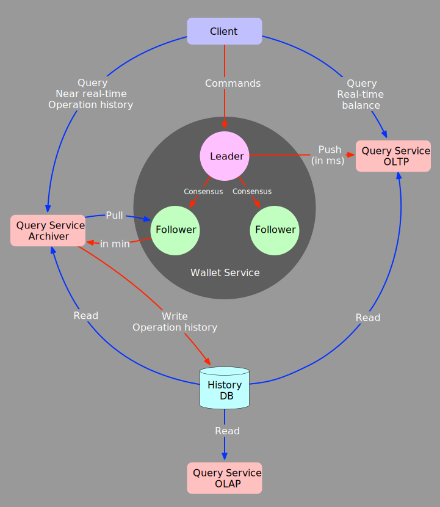
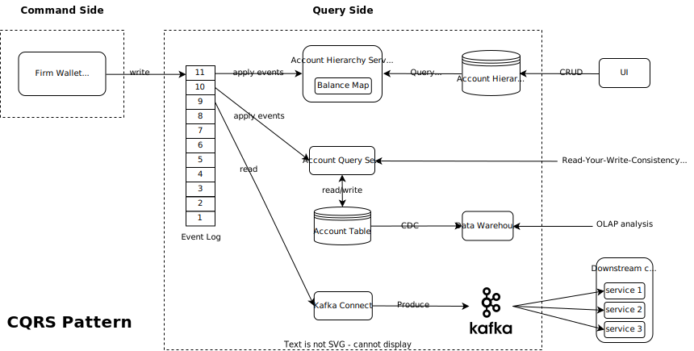
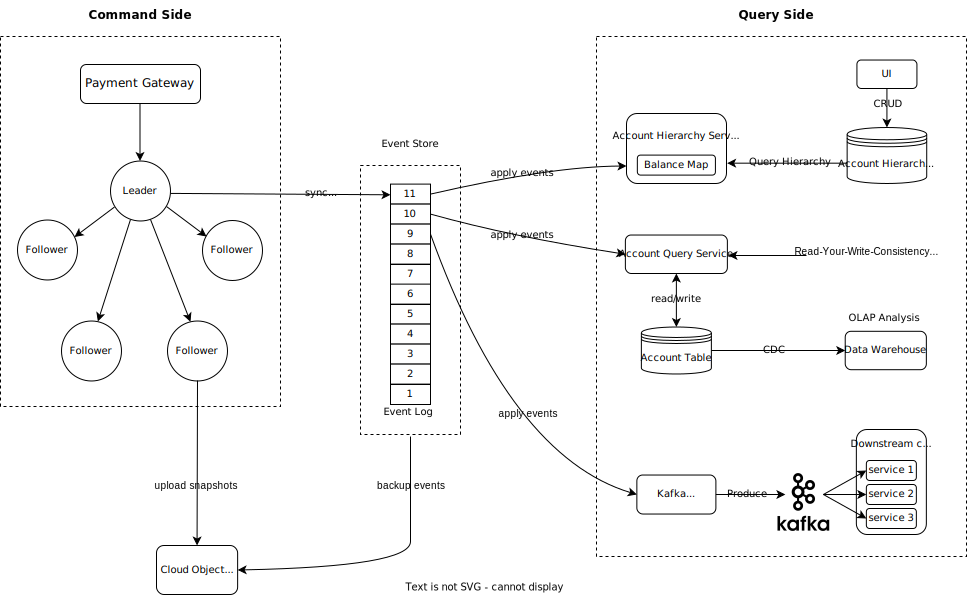

# Auticuro: A High Performance, Strong Consistent, Distributed Wallet Service

## 1. Introduction
**Auticuro** is a high performance, strong consistent, distributed wallet service fitting for mission-critical financial 
applications. It provides account management and balance operation functionalities, which could be used to build composite
money movement functionalities required by customers.

Besides providing **exactly-once** money movement guarantees, **Auticuro** also supports TCC/SAGA balance operation APIs to
ensure atomicity for multiple balance operations.

**Auticuro** has predictable low latency(**P99 < 20ms** when TPS = **10K**, tested against a 5-node deployment on GCP) 
and high-availability(RTO <= **4s** for fault recovery), which make it a suitable corner stone for critical financial 
applications.

## 2. Features
### 2.1. Functional Features
  - Balance operations 
    - ✅ Bilateral money transfer
    - ✅ Batch balance operation (Increase/Decrease balance on multiple accounts atomically)
  - Account management operations
    - ✅ Create/Delete/Lock/Unlock an account
    - ✅ Change the upper/lower balance limit of an account
- ✅ Support multi asset class (cash, crypto, coupon…)
- Support account hierarchy(TBD)

### 2.2. Non-functional Features
- **High throughput**: Separated reads and writes, no lock on the critical write path
- **High availability**: Built upon a Raft-based consensus message queue to achieve HA
- **Low latency**: The wallet service pushes down computation to the storage layer to achieve low latency 
- **Horizontal scalability**: The horizontal scalability can be achieved with the help of an in-house transaction manager(Marker)

## 3. Design and Architecture
### 3.1. CQRS with Event Sourcing 
CQRS stands for Command and Query Responsibility Segregation, a pattern that separates reads and writes into different 
models, using **commands** to update data, and **queries** to read data.

Benefits of CQRS include:
- **Independent scaling**. CQRS allows the read and write workloads to scale independently, and results in fewer lock contentions.
- **Optimized data schemas**. The query side can use a schema that is optimized for queries, while the command side uses 
    a schema that is optimized for updates.
- **Separation of concerns**. Segregating the command and query sides can result in models that are more maintainable and flexible.  

Event Sourcing:

Instead of storing just the current state of the data in a domain, an append-only store is used to record the full series of 
actions taken on that data. The store acts as the system of record and can be used to materialize the domain objects.

<p style="text-align: center;">

</p>

Above is the high-level architecture of **Auticuro**, which uses CQRS with Event Sourcing. At the core is the command 
side(wallet service cluster), and the surrounding services are query side services. The **Auticuro** project currently 
contains the command side, query side services will be open sourced-in the future.

#### 3.1.1. Command Side
- **Wallet Service Cluster**
  
  The wallet service cluster consists of one leader and several followers. The leader handles write requests from 
  clients and replicates data to follower nodes using the Raft consensus algorithm. Implementation-wise, Rust language 
  is selected for its performance comparable to C++, as well as the language property of memory and thread safety.
  Command side would generate events and replicates the events into the event store.
  
#### 3.1.2. Query Side
The query side provides materialized views of the accounts. These views are tailored to the requirements of the 
application, which helps to maximize the query performance. Because the event store is the golden source of accounts, 
it is possible to delete the materialized views and replay all past account/balance change events to create a new 
representation of the current state when the query side system evolves, or when the query side data model must change. 
The materialized views are in effect a durable read-only cache of the events.

Generally, query services can be characterized into below categories:

- **Query Service(Archiver)**

  It replicates commands and events from the command side and persists all the historical commands and events.  

- **Query Service(OLTP)**

  Derived views are built from the event stream, a typical scenario is to calculate the near real-time account balance at
  the non-leaf level. It is very flexible since whenever a new derived view is needed, a new query service can just be
  added without changes to the existing services.

- **Query Service(OLAP)**

  Event streams can be synchronized from PG to data warehouse through CDC, such that complex analytical queries can be supported.

### 3.2. Command Side
<p style="text-align: center;">

</p>

The above figure shows how gRPC requests are handled by the **leader** node of the wallet service cluster. Each node
in the cluster holds its raft log, `WalletStateMachine`, with attached `RocksDB` and `WalletStateMachine`. 
The raft log replication process is not shown here.

#### 3.2.1. Request Handling:
- **Thread 1**: The Foreground gRPC Thread

  - **Step 1**. The gRPC thread accepts a `TransferRequest`, appends it to the raft log, and waits for that request to be 
    committed, and receives the corresponding raft `log_index` (This implies that the log entry has been persisted on
    majority nodes, and ready to be applied).
  
  - **Step 2**. The gRPC thread registers the `TransferRequest` into the `MessageBroker` with that `log_index`, and waits 
    for the `TransferResponse` from the `MessageBroker` and replies that response to the client.

- **Thread 2**: Single-Threaded Log Consumer
    
  - **Step 1**. The `LogConsumer` polls that committed log entry from the raft log and deserializes the log entry to the
    `TransferRequest`.
  - **Step 2**. The `LogConsumer` sends the `TransferRequest` to the `WalletStateMachine` via the Single Producer Single 
    Consumer (SPSC) channel.

- **Thread 3**: Single-Threaded Lockless Critical Path

  - **Step 1**. The `WalletStateMachine` receives the `TransferRequest` from the SPSC channel, de-duplicates via `DedupId Store`,
    updates the `BalanceMap`, generates the `TransferResponse` and `BalanceChangeEvent`, and persists both`BalanceChangeEvent`
    and `dedupId` into RocksDB. 
  - **Step 2**. The `WalletStateMachine` registers the `TransferResponse` into the `MessageBroker` with that `log_index`.
  
- **Thread 4**: Single-Threaded Message Broker

  - **Match**. The `MessageBroker` is an infinite loop matching the `TransferRequest` from the gRPC thread and the 
    `TransferResponse` from the `WalletStateMachine` via the `log_index`.

### 3.3. Query Side
<p style="text-align: center;">

</p>
Query side services apply the balance/account change events generated by the command side service, and generate
materialized views to serve different query requirements. Typical query side services include:

#### 3.3.1. Account Hierarchy Service
It is very common that accounts might have a tree-like hierarchies, balance operations only applies to leaf accounts, and
balance of non-leaf accounts need to be calculated. An account hierarchy service can be built to satisfy this 
requirement:
- The `Account Hierarchy Service` applies events and builds leaf accounts' balance
- The `Account Hierarchy Service` reads account hierarchy config from database and calculate the non-leaf account's balance 
  by aggregating the balance of its child accounts.
- Users could CRUD account hierarchy configs via the UI.

#### 3.3.2. Account Query Service
The `Account Query Service` provides the Read-Your-Write consistency query for account balances and balance change history:
- The balance change events contains the account version number, facilitating account-wise balance history pagination query.
- The `Account Query Service` record and apply events to build the account balance of different versions.
- The versioned account balance can be replicated to data warehouse for OLAP analysis.

#### 3.3.3. Kafka Publisher
The events can be published to `Kafka` for downstream system integration.

### 3.4. Fault Tolerance
<div style="text-align: center;">

</div>

Above is the whole ecosystem of **Auticuro**. The whole system is fault-tolerant because
  - **Command Side**(Wallet service cluster)
    
    A typical deployment of the wallet service cluster consists of 5 replicas(1 leader + 4 followers). The cluster is 
    available as long as the majority(n >= 3 in this case) are alive. If a follower has a transient network failure or pod failure, 
    the cluster would not be affected, meanwhile, the failed follower would catch up with the cluster when it recovers. 
    If the leader fails, a new leader will be elected among the remaining 4 followers, the RTO(Recover Time Objective) 
    is less than 4 seconds.
    
    The wallet service will periodically snapshot its state and upload snapshots to cloud object storage, which
    facilitates the recovery when a replica undergoes disk failure.
    
  - **Event Store**
    
    RDBMS is used to store all the events, and historical events will be backed up to the cloud object storage. If the RDBMS 
    undergoes a temporary failure, query services could fallback to query events directly from the command side, if the 
    RDBMS undergoes a permanent failure, the event store could recover event logs from cloud object storage.

  - **Query side** 

    Query services are stateless Deployment in k8s, such that they could tolerate pod failure since they can always 
    rebuild their states by replaying the events. 
    
## 4. Quick Start
Follow the quick start [guide](docs/quickstart.md) to set up environment and run Auticuro locally

## 5. Configurations
Follow the [guide](docs/configuration.md) to customize configurations for Auticuro

## 6. Performance

### 6.1. Test Config

8 vCPUs * 5 node cluster on GCP, attached with SSD persistent disks (pd-ssd). A rust-based performance testing tool was 
built for the wallet service, the tool will start multiple coroutines and send requests sequentially to the server.

### 6.2. Test Result
|RPC type|Concurrency |Metadata Payload|TPS|Avg. Latency (ms)|p99 Latency (ms)|
|:---:|:---:|:---:|:--:|:---:|:---:|
|     Transfer     |100|128B|10k|6|19|

- Latency Distribution vs Throughput

  **P99 latency < 20 ms @ TPS=10K**

  

## 7. Monitoring
### 7.1. Http Metrics Server

An HTTP metrics server is built on each node to
check [prometheus](https://prometheus.io/docs/prometheus/latest/getting_started/)
metrics and change the log level dynamically.

```
# Get prometheus metrics
curl http://0.0.0.0:20211/metrics

# Change log level
curl -X PUT http://0.0.0.0:20211/log-level -d '{"log-level":"debug"}'
curl -X PUT http://0.0.0.0:20211/log-level -d '{"log-level":"info"}'
```