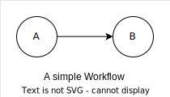

## 1. Introduction

With the rise of e-commerce, mobile payments, and digital currencies, people have become more reliant on digital transactions. Traditional cash-based payment has its limitations. Cash is not always practical or safe to carry around.

A wallet service is a software application that allows users to manage their financial assets, such as digital cash, cryptocurrency, and investments, all in one place. Wallet services can be provided by banks, payment processors, and third-party companies.

The wallet service is **mission-critical** because it is used to manage users' money and financial data, which is of utmost importance to them. Any errors or failures in the wallet service could result in financial losses or other negative consequences for users.

In addition, the wallet service is often used in **real-time**, which means that users need to be able to access and use the service at any time without delay. For example, if a user wants to make a payment or transfer funds, they need the wallet service to be fast and responsive to complete the transaction quickly and accurately.

As the **popularity** of online wallet services continues to grow, more users are relying on them for managing their financial transactions, making payments, and transferring funds. This increased demand puts pressure on the service to deliver a fast and reliable user experience. If the service cannot handle the load, it can result in slow transaction processing times, timeouts, and system crashes, leading to a poor user experience and loss of business.

When designing a wallet service, several key factors need to be considered.

**Functional**:

1. **Payment processing**: Ensures that money movement or payment is processed without duplication or loss.
2. **Account Creation and Management**: Allows users to create and manage accounts, providing a single platform for managing all accounts and reducing the risk of errors and discrepancies.
3. **Account Hierarchy View**: Allows users to create a tree-style structure of accounts, making it easier to organize and track transactions across multiple accounts. Provides a single view of the total balance across all accounts and sub-accounts, allowing users to assess their financial position quickly.
4. **Transaction History and Auditing**: The wallet service should have an accurate and immutable history as the source of truth,  providing explainability and traceability for auditing or regulatory requirements.

**Non-Functional**:

1. **Availability**: Provides redundancy and failover mechanisms to ensure system availability and data integrity in the event of technical issues.
2. **Low-latency**: Provides real-time processing of transactions, enabling users to make payments and transfers quickly and efficiently.
3. **Scalability**: Implements a distributed architecture to ensure the system can handle increased traffic and demand as the user base grows.
4. **Evolvability**: Decouples business logic and fundamental APIs, making the system easily adapt to changing business requirements or customer needs without requiring a complete overhaul of the entire system.

In this article, we will dive into the distributed wallet service implemented in Airwallex, examining its architecture, detailed design, and performance.

# 2. Architecture and Design Decisions

As depicted in the following diagram, the distributed wallet service is divided into three layers:

* The Access Layer which translates incoming flexible business requests into underlying stationary account operations,
* The Transaction Layer, a.k.a. Marker, which orchestrates cross-shard money movements with ACID guarantees, where ACID refers to the four key properties of a transaction: atomicity, consistency, isolation, and durability.
* The Storage Layer, a.k.a. Auticuro, which supports low-level, high-performance atomic account operations within a single shard.

Shards within the same layer do not communicate, while shards from different layers are fully connected. For example, Replicas in Access Layer can talk with any shard from the Transaction Layer or Storage Layer, and shards in the Transaction Layer can talk with any shard from Storage Layer.

## 2.1 Decouple Transaction Layer and Storage Layer

The most important design decision we made was to decouple the transaction layer and storage layer. The decoupling dramatically decreases the engineering complexity and maintenance overhead while increasing the performance of transaction management and account operations.

The transaction layer is computation-intensive, while the storage layer is data-intensive. The transaction layer should be scaled up and down according to the traffic volume, while the storage layer should be scaled up according to the number of accounts. A new shard in the transaction layer can be brought up when encountering traffic spikes and decommissioned as long as it has no ongoing transactions.

A shard in the storage layer with a naive single-threaded implementation could easily achieve more than 20,000 account operations per second. In contrast, a carefully designed and implemented shard in the transaction layer can schedule 2,000 transactions per second.

According to our prior experience, the monolithic solution have challenges including:

* Hard to implement and evolve in terms of engineering
* Much slower than the decoupled solution since it needs to handle quite a few complex situations relating to the pending conditional transfer due to the coupling of transaction management and account operation
* Hard to smoothly scale up and down when encountering traffic spikes since any scaling would require repartitioning

## 2.2 Decouple Flex and Stationary

The wallet service separates the fundamental balance operation APIs from the business-facing APIs; the former is implemented in the storage layer, and the latter is implemented in the access layer. It offers several benefits:

* Independent Scalability: Decoupling the layers allows each layer to scale independently based on its specific requirements. The fundamental balance operation APIs are stable and should be changed conservatively, while the business-facing APIs need to evolve quickly to adapt to the business requirements.
* Easier to test and debug: Separating the core balance operation APIs from the business-facing APIs makes it simpler to test and debug each layer independently, ensuring a more robust and reliable system.

## 2.3 Decouple Read and Write - CQRS with Event Sourcing

Command and Query Responsibility Segregation (CQRS) means separating reads and writes into different models, using commands to update data and queries to read data. Commands represent actions to change the state of the system. Usually, we refer to the command as the write operation. We would prefer the use of command and will use it throughout this document. You can think they are the synonyms of the write operations. Benefits of CQRS include:

* Independent scaling. CQRS allows the read and write workloads to scale independently and results in fewer lock contentions.
* Optimized data schemas. The query side can use a schema optimized for queries, while the command side uses a schema optimized for updates.
* Separation of concerns. Segregating the command and query sides can result in models that are more maintainable and flexible. Additionally, the command and query sides could have different optimization and scaling solutions.

Instead of storing just the current state of the data in a domain, in Event Sourcing, an append-only store is used to record the full series of actions taken on that data. The store acts as the golden source, and the records can be used to materialize the domain objects.

Marker and Auticuro follow the CQRS pattern with Event Sourcing, each shard of which is separated into the command side and query side, connected by an event store. Only the most critical logic, such as real-time balance check, is processed on the command side. Others are processed on the query side, tailored for query performance.

## 2.4 Decouple Account Structure and Storage

The wallet service supports account hierarchy - a tree-like structure where an account can have a bunch of sub-accounts, and the account's balance is the total balance of its sub-accounts.

* Money movements are only allowed on the leaf accounts
* Balance queries of all accounts(leaf account + non-leaf accounts) are supported.

We decouple the two functionalities with CQRS methodology, putting the leaf account storage model on the command (write) side and the account hierarchy models on the query side because these two models are orthogonal. In this way, they can scale or adapt to business change independently.

## 2.5 Correctness, Dependability, and Performance

The wallet service is implemented in the Rust programming language to achieve correctness and performance. Rust’s rich type system and ownership model guarantee memory safety and thread safety. Rust is blazingly fast and memory efficient: with no runtime or garbage collector, powering performance-critical services.

The wallet service employs a single-threaded, lockless critical path to reduce contention, improve throughput, and reduce latency. This choice dramatically reduces the engineering complexity as error-prone multi-threaded code is discarded without hurting the performance.

The command side of Marker and Auticuro is built on top of the [Raft algorithm](https://raft.github.io/), leveraging Raft to achieve strong consistency and high availability. Raft is a consensus algorithm, which is a protocol used in distributed systems to achieve agreement among multiple nodes on a specific value or state, even in the presence of failures. Raft achieves consensus via an elected leader. A server in a raft cluster is either a leader or a follower and can be a candidate in the precise case of an election (leader unavailable). The leader is responsible for log replication to the followers.

# 3. Detail Design

We’ve explained the high-level architecture and design decisions of the wallet service, now let’s dive into the detailed designs. We will go through the design of the storage layer, the transaction layer, and cross-shard money movements respectively.

## 3.1 Storage Layer

As mentioned above, Auticuro is the storage layer of the wallet service. It provides account management and balance operation functionalities used to build composite money movement functionalities that businesses require.

Auticuro has predictable low latency (P99 &lt; 20 ms when TPS = 10,000, tested against a single Auticuro shard with a 5-node deployment on GCP) and high availability (RTO &lt;= 4s for fault recovery), making it a suitable cornerstone of critical financial applications.

### 3.1.1 Details of an Account

An account is divided into four parts: TransactionSection, Available, ReservedSection, and Configuration.

TransactionSection is a mapping from transactionId to its PendingIn amount and PendingOut amount manipulated by the TCC interfaces explained later in section 3.3.2.

ReservedSection is a mapping from reservationId to its reserved amount, which supports Reserve, IncrementalReserve, Release, and PartialRelease interface.

The Reserve interface allows reserving an amount of money within an account for future usage purposes by moving the money from the available section to the reserved section. The only permitted operation on that reserved money is the Release interface which moves the money back to the available section. IncrementalReserve and PartialRelease are just variants of Reserve and Release.

The Configuration contains fields like UpperLimit, LowerLimit, State, Currency, and Version, which could be updated by UpdateUpperLimit, UpdateLowerLimit, LockAccount, and UnlockAccount interface.

The Transfer interface is a bilateral money movement between two accounts inside the same Auticuro shard. BatchBalanceOperation is a batch of money movement for accounts inside the same Auticuro shard, and each money movement credits or debits an amount from one account.

Updating the account follows a Copy-On-Write pattern. Instead of directly updating the account, each modification will be applied to a copy of the account. Each time the copy-on-write happens, we will assign an increased version number to it. so we know the entire history of the account modification.

### 3.1.2 CQRS with Event Sourcing

Above is the high-level architecture of one Auticuro shard, which uses CQRS with Event Sourcing (defined in section 2.3).

#### 3.1.2.1 Command Side

The command side of the Auticuro shard is written in Rust to achieve high performance and correctness and uses Raft to achieve dependability under cloud environments. It processes requests for account management and balance operation, supports real-time balance checks in critical-path, and generates event logs streamed to the query side in a real-time manner.

Auticuro leverages its single-threaded critical path and Copy-On-Write pattern to achieve all-or-nothing semantics for a batch of operations. If any of the operations in a batch fails due to balance limitation checks or improper account state, the preceding changes made by that batch on cloned accounts are discarded, leaving the state unchanged.

#### 3.1.2.2 Query Side

The query side provides materialized views of the accounts by replaying event logs tailored to flexible business requirements to maximize the query performance. These views are read-only caches of the events, while the event store is the golden source of truth. It is essential that the command side generates events with a consecutive sequence number, which can be used by query sides to perform integrity checks and detect missing or out-of-order events. When the query side system is damaged, its state can be restored by replaying all past account/balance change events, and snapshots are used to accelerate the process. Typical query side services are as follows:

**Account Hierarchy Service**

Our client could set up multiple accounts for a specific business requirement and organize them as a tree-style hierarchy. Leaf accounts support modifications such as account management and balance operations, while non-leaf accounts are unmodifiable and illustrate an aggregated read-only view.

An Account Hierarchy Service is built to satisfy the above requirement:

* The Account Hierarchy Service applies events and calculates leaf accounts' balance
* Users could CRUD account hierarchy configs via the UI, where CRUD is the acronym for CREATE, READ, UPDATE, and DELETE.
* When receiving a query request, the Account Hierarchy Service reads the account hierarchy config from the database and calculates the non-leaf account's balance by aggregating the balance of its children recursively.

**Account Query Service**

The Account Query Service provides the Read-Your-Write consistency query for account balances and balance change history.  After you've updated the account, it is very natural that if you immediately read it back, you should read your last modification. This is called read-your-write consistency. It is desirable because it provides a more intuitive experience for users and can help ensure correct application behavior.

* The Account Query Service applies events to build every version for every account.
* Each account instance contains a version number, facilitating account-wise pagination queries for change history.
* The versioned accounts are replicated to a data warehouse like BigQuery(an enterprise data warehouse product of Google) for OLAP analysis.

**Kafka Connector**

The events are published to Kafka for downstream systems to subscribe from.

#### 3.1.2.3 Fault Tolerance

All components in the above Auticuro shard are fault tolerant. Let's analyze how to achieve fault tolerance from the write side to the read side.

**Command Side**

* Network/Pod Failure

  A typical deployment of one Auticuro shard consists of 5 replicas(1 leader + 4 followers), which is available as long as the majority (n >= 3 in this case) are alive. If a follower undergoes a transient network failure or pod failure, the service would not be affected. Meanwhile, the failed follower would catch up when it recovers. If the leader fails, a new leader will be elected among the remaining 4 followers, and the RTO (Recovery Time Objective) is less than 4 seconds.

* Disk Failure

  Auticuro periodically snapshots its state and uploads generated snapshots to cloud object storage, accelerating the recovery when a replica undergoes disk failure.

* Error Detection

  A recon engine incrementally pulls the raft log and event log from all 5 replicas in the background and compares them to detect potential divergence of the state machine. If divergence is detected, fault handling like rollback/roll forward is performed.

**Event Store**

Databases like PostgreSQL store recently pulled events and backups them to cloud object storage via CDC, where CDC, a.k.a. Change Data Capture, refers to the process of identifying and capturing changes made to data in a database and then delivering those changes in real-time to a downstream process or system.

If RDBMS undergoes temporary failure, services on the query side fall back to query events directly from Auticuro. If RDBMS undergoes permanent failure, the event store recovers historical events from cloud object storage and recent events from Auticuro.

**Query Side**

Services on the query side are stateless deployment in k8s, recovering from pod failure by rebuilding the states from the event log.

### 3.1.3 How does Auticuro work?

The above figure shows how a TransferRequest is handled inside the leader of one Auticuro shard, supporting real-time balance checks in the critical path:

The TransferRequest is persisted into the raft log unconditionally, even if it is a duplicated one. In real life, one raft log entry may consist of a batch of transfer requests to amortize the time cost of permanently writing the data to disk, done by the system call fsync of Linux/Unix.

The event log stores the balance change event generated by the transfer request. Each event is assigned a consecutive integer starting from 1, used by downstream systems to verify the integrity of the event stream. A duplicated transfer request in the raft log will be detected by DedupId Store and discarded, leaving the BalanceMap unchanged and no event generated.

**Thread 1: The Foreground gRPC Thread**

* **Step 1**. The gRPC thread accepts a TransferRequest, appends it to the raft log, waits for that request to be committed, and receives the corresponding raft log_index (This implies that the log entry has been persisted on the majority nodes and is ready to be applied).
* **Step 2**. The gRPC thread registers the TransferRequest into the MessageBroker with that log_index and waits for the TransferResponse from the MessageBroker and replies that response to the client.

**Thread 2: Single-Threaded Log Consumer**

* **Step 1**. The LogConsumer polls that committed log entry from the raft log and deserializes the log entry to the TransferRequest.
* **Step 2**. The LogConsumer sends the TransferRequest to the WalletStateMachine via the Single Producer Single Consumer (SPSC) channel.

**Thread 3: Single-Threaded Lockless Critical Path**

* **Step 1**. The WalletStateMachine receives the TransferRequest from the SPSC channel, de-duplicates via DedupId Store, updates the BalanceMap, generates the TransferResponse and BalanceChangeEvent, and persists both BalanceChangeEvent and dedupId into RocksDB.
* **Step 2**. The WalletStateMachine registers the TransferResponse into the MessageBroker with that log_index.

**Thread 4: Single-Threaded Message Broker**

* **Match**. The MessageBroker is an infinite loop matching the TransferRequest from the gRPC thread and the TransferResponse from the WalletStateMachine via the log_index.

## 3.2 Transaction Layer

Marker is a dependable, lightweight, scalable, and distributed Transaction Manager built from scratch for our distributed wallet service that could scale to 1,000,000 TPS.

Marker provides ACID guarantees and predictable latency for cross-shard money movements by orchestrating them as a Directed Acyclic Graph (DAG), following the topological order explained later.

Marker uses the same CQRS pattern with Event Sourcing (see section 2.3) as the storage layer Auticuro, so they share the same engineering advantages.

### 3.2.1 Concepts of Workflow

The basic execution unit inside Marker is a Workflow Instance that is a DAG, whose vertex is a Job and whose edge is a Dependency between two Jobs.

Jobs are scheduled according to topological order: a Job is available for scheduling when all of its incoming Dependencies are fulfilled, and concurrent Jobs are scheduled parallelly yet completed sequentially.

Here are some fundamental concepts:

* Context: a private JSON Object shared by all the Jobs of a workflow instance.
* JobRequest: the request sent to the worker, built from the Context.
* JobResponse: the response received from the worker, used to update the Context.
* Precondition: a boolean expression evaluated on fields inside the Context set by preceding Jobs.

A dependency without a Precondition is fulfilled as long as its predecessor Job is finished, while a dependency with a Precondition is fulfilled when its predecessor Job is finished and its Precondition is fulfilled.

A Workflow Instance achieves its finished state when no more available Jobs are ready for scheduling.

The lifecycle of a Job is:

* Pending: not all incoming dependencies fulfilled,
* Available: all incoming dependencies fulfilled, ready for scheduling,
* Activated: Job is assigned with JobRequest sent,
* Finished: Job is finished with JobResponse received.

Marker uses the CQRS pattern with event sourcing. With this pattern, the state of a workflow instance is stored as a sequence of events. Each event represents a set of changes to the workflow instance. The current state is constructed by replaying the events.

### 3.2.2 CQRS with Event Sourcing

The above graph is a high-level architecture of one Marker shard, which follows the CQRS pattern with Event Sourcing.

The center part is the Command Side (Core Service that uses the Raft algorithm to achieve Dependability). The left part is the Workers integrated with Marker and Services embedding the Marker Client Lib. The right part is the Query Service which pulls the raft log, rebuilds the Marker StateMachine by replaying the raft log, and serves the OLTP query requests.

Here is the interaction between components when handling a business request:

* Gateway enriches the business request into a CreateWorkflow request according to Service Orchestration Rules and forwards it to Core Service.
* Core Service schedules the Jobs of the workflow in topological order by sending AssignsJob requests to workers and waits for FinishJob requests from workers.
* Query Service pulls the event log, rebuilds the workflow's states in real time, and serves the query request from Gateway.

### 3.2.3 How does Marker work?

#### 3.2.3.1 Marker StateMachine

A Marker shard uses both memory and disk to hold unfinished workflows. Workflows are handled in a FIFO order. If the number of unfinished workflows exceeds a predefined threshold, the newly created workflows will spill to disk. Here are the components of the Marker StateMachine:

* ActiveWorkflows: an in-memory queue holding the workflows under scheduling.
* PendingWorkflowQueue: a disk queue holding the spilled workflows.
* FinishedWorkflows: a disk-based storage engine, e.g. RocksDB, holding recently finished workflows to facilitate the QueryService.
* AvailableJobs: a mapping from a workflow to its Jobs in the Available state,
* ActivatedJobs: a mapping from a Worker to the Jobs assigned to that worker

If a worker crashes while handling these Jobs, Marker will help the worker to recover its ongoing Jobs when it registers with Marker again, which makes stateless service a good adoption for workers.

#### 3.2.3.2 Threading Model

**ApplyLoop** is the single-threaded critical path that reads committed raft log entries and applies them to the Marker StateMachine. This thread runs in the leader and followers parallelly to build the replicated state machines to achieve dependability.

There are 3 types of events (CreateWorkflowEvent, AssignJobEvent, and FinishJobEvent). They are persisted into the raft log unconditionally, while before applying them, ApplyLoop will check the Marker StateMachine to discard the duplicated and/or stale ones.

When running in the leader, **ProcessLoop** is the single-threaded critical path that handles the newly generated AvailableJobs and ActivatedJobs emitted by Marker StateMachine. For AvailableJobs, it checks the workers registered in the leader, picks one with a matching job type, and tries to persist an AssignJobEvent into the raft log so that this assignment can survive failures. For ActivatedJobs, it fetches the gRPC channel of the assigned worker and sends the JobRequest to that worker via the channel.

When running in followers, ProcessLoop evicts their registered workers, forcing them to re-register with the leader eagerly.

**gRPC Threads** persist CreateWorkflowEvent and FinishJobEvent into the raft log unconditionally, even though these events may be duplicated and/or stale, which will be detected and discarded by ApplyLoop before applied to the Marker StateMachine.

#### 3.2.3.3 Life of a simple workflow 

  

* **Step 1**: The client sends a CreateWorkflow request for the above sample workflow that consists of 2 Jobs A and B.
* **Step 2**: A CreateWorkflowEvent is persisted into the raft log unconditionally.
* **Step 3**: After that log entry is committed, ApplyLoop applies it to the Marker StateMachine:
  * One active workflow is created,
  * Job A transitions to Available since it has no incoming dependency,
  * Marker StateMachine emits Job A as the newly generated AvailableJobs.
* **Step 4**: ProcessLoop picks one worker for Job A, and An AssignJobEvent is persisted into the raft log unconditionally.
* **Step 5**: After that log entry is committed, ApplyLoop applies it to the Marker StateMachine:
  * Job A transitions to Activated
  * Marker StateMachine emits Job A as the newly ActivatedJobs.
* **Step 6**: ProcessLoop fetches the gRPC channel of the assigned worker and sends the JobRequest to that worker via the channel.
* **Step 7**: The worker sends a FinishJob request for Job A after finishing Job A.
* **Step 8**: A FinishJobEvent is persisted into the raft log unconditionally.
* **Step 9**: After that log entry is committed, ApplyLoop applies it to the Marker StateMachine:
  * Job A transitions to Finished, Dependency &lt;A, B> Fulfilled, Job B transitions to Available.
  * Marker StateMachine emits Job B as the newly generated AvailableJobs.
* Omit the remaining steps since the Handling of Job B is the same as that of Job. A.

## 3.3 Cross-Shard Money Movements

Cross-shard money movements are implemented as distributed transactions with ACID guarantees. Our distributed wallet service supports two kinds of distributed transactions: Saga and TCC.

### 3.3.1 Saga

The Saga pattern provides transaction management using a sequence of local transactions. A local transaction is the atomic work effort performed by a saga participant. If a local transaction fails, the saga executes a series of compensating transactions that undo the changes made by the preceding local transactions.

In our distributed wallet service, any Marker shard is an independent saga transaction manager, while all Auticuro shards are saga participants that support compensating local transactions. Besides the basic saga pattern, our distributed wallet service implements a saga pattern with optimistic locking.

Optimistic locking is a concurrency control method that assumes that conflicts between multiple transactions are rare. Instead of locking the resources for the entire transaction duration, optimistic locking allows multiple transactions to access the same resource simultaneously. Before committing a transaction, the system checks if the resource has been modified by another transaction since it was last read. If the resource has been modified, the transaction fails, and the client must retry the transaction.

Here is an example of a saga with optimistic locking. The client has three cards A, B, and C. A and B are credit cards with a maximum balance of 0, and C is a debit card with a minimum balance of 0. Before top-up, the balance of A, B, and C is -30, -20, and 0. Now our client wants to deposit 100 with the expectation that pay the debt in credit cards A and B first, then deposit the remaining to debit card C.

The execution is divided into two phases. In the first phase, the gateway queries the balances of A, B, and C. In the second phase, the gateway builds up an execution plan:

* Deposit 30 to card A with the expectation that A has a balance of -30 before top-up
* Deposit 20 to card B with the expectation that B has a balance of -20 before top-up
* Deposit 50 to card C unconditionally

During execution, any concurrent changes to A, B, and C will lead the saga transaction to fail and roll back, for example:

* The client withdraws 10 from credit card B(changing the balance of B from -20 to -30) after the execution of the first phase, then during the second phase, the deposit of B will fail due to unsatisfied expectations on the balance of B, since it is not acceptable that balance of B is -10 while that of C is 50 (you should always pay the debt first).
* The client deposits 10 to credit card A(changing the balance of A from -30 to -20) after the execution of the first phase, then during the second phase, the deposit of A will fail due to unsatisfied expectations on the balance of A, since the maximum balance of credit card is 0.

### 3.3.2 TCC

TCC, Try/Confirm/Cancel, is a two-phase commit protocol that divides the commitment of transactions into two phases:

1. In phase one, TCC performs business checks (for consistency) and reserves business resources (for quasi-isolation). This defines the try operation of TCC.
2. In phase two, if the reservation of all business resources is successful in the try phase, the confirm operation is performed. Otherwise, the cancel operation is performed.

The confirm operation acts only on the reserved resources without business checks. If the operation fails, the system keeps retrying. The cancel operation cancels the execution of a business operation, releases the reserved resources, and retries if it fails.

In our distributed wallet service, any Marker shard is an independent transaction coordinator, while all Auticuro shards are transaction participants that support the Try, Confirm, and Cancel interface.

Here is an example of cross-shard money movements: A - 10, B - 10, C + 20, while A, B, and C are located in different Auticuro shards.

When Gateway(the Access Layer) receives such a request, it builds a workflow instance as above and sends it to a Marker shard routed by the hash of the workflow id. That Marker shard schedules the execution of the Jobs according to Topological Order.

In Phase 1, three Jobs TryA, TryB, and TryC are scheduled in parallel.

Jobs like SyncPoint, ConfirmAll, and CancellAll are internal Jobs executed independently inside Marker. Job ConfirmAll or CancelAll is triggered by evaluating the Precondition on JobResponse of TryA, TryB, and TryC.

In Phase 2, ConfirmAll triggers the parallel execution of ConfirmA, ConfirmB, and ConfirmC, while CancelAll triggers the parallel execution of CancelA, CancelB, and CancellC. Each of the Jobs retries until succeeding.

# 4. Evaluation

Comprehensive tests are conducted against the **single-shard Auticuro **to assess its correctness, robustness, and performance.

## 4.1 Chaos Test

Chaos test, also known as fault injection, in which we intentionally introduce failures into a system to evaluate its ability to maintain function and recover gracefully.

The test deployment:

* A 5-replica **Auticuro** k8s stateful set on the GCP
* A request sender that keeps sending requests to the Auticuro @ 200TPS
* A consistency checker that checks the consistency of the raft/event logs and wallet state machine among the five replicas.

Chaos test scenarios:

* Injecting pod failure in a round-robin way every 10 minutes
* Injecting network loss failure in a round-robin way every 10 minutes

Test Result:

* More than **100M** requests are processed by the Auticuro cluster without duplicate or loss, during which there are more than **1000** times pod/network chaos happened.

## 4.2 Stress Test

We use 8 vCPUs * 5 node clusters on GCP, which are attached with SSD persistent disks (pd-ssd). The** P99 latency &lt; 20ms** when **TPS = 10K. **

Different workloads are tested, and the detailed latency distribution vs. throughput is shown below:

In summary, Auticuro has proven to be a low-latency, high-performance, and reliable storage engine that suits mission-critical financial applications. We aim to provide an exceptional wallet service solution and contribute to the fintech industry and open-source community by sharing our insights, knowledge, and experiences.

